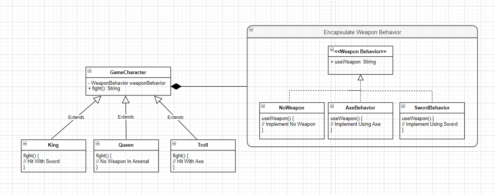
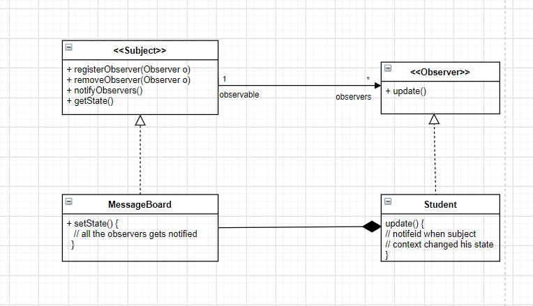
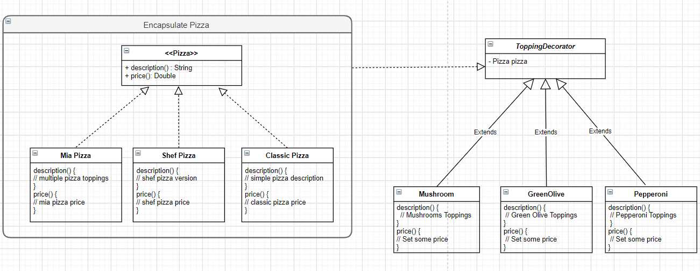

            

# Java Design Patterns 

## About The Project
In this project I'm implementing multiple design pattern with the help of the book "Head First Design Pattern" which gets implemented upon my own context

## Design Patterns Implementations
## 1. Strategy 

            

## 2. Observer

            

## 3. Decorator

            

4. Factory
5. Command 
6. Singleton Thread Safe
7. Memento
8. Adapter 
